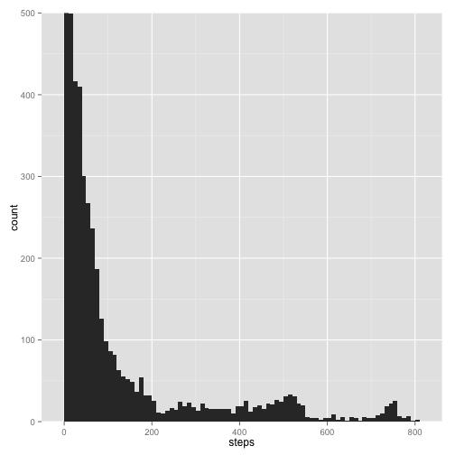
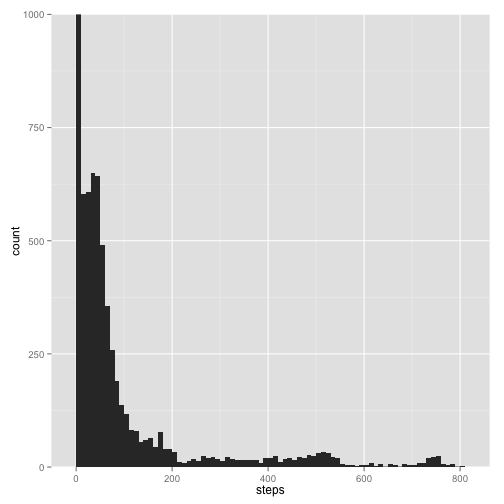

Peer Assessment 1
========================================================

Loading and preprocessing the data


```r
echo = TRUE
library(ggplot2)
setwd("/Users/jamessweeney2/Desktop/Coursera")

## Load the data
activity <- read.csv("activity.csv")

## Remove NA data
act <- activity[!is.na(activity$steps),]
```

What is the Mean total number of steps taken per day?


```r
## Create hisogram of steps per day
g <- ggplot(data = act, aes(x = steps))
g + geom_histogram(binwidth = 10) + coord_cartesian(ylim = c(0, 500))
```

 

```r
## Calculate mean and median steps per day and print
means <- tapply(act$steps, act$date, mean)
medians <- tapply(act$steps, act$date, median)
print(means, digits = 0)
```

```
## 2012-10-01 2012-10-02 2012-10-03 2012-10-04 2012-10-05 2012-10-06 
##         NA          0         39         42         46         54 
## 2012-10-07 2012-10-08 2012-10-09 2012-10-10 2012-10-11 2012-10-12 
##         38         NA         44         34         36         60 
## 2012-10-13 2012-10-14 2012-10-15 2012-10-16 2012-10-17 2012-10-18 
##         43         52         35         52         47         35 
## 2012-10-19 2012-10-20 2012-10-21 2012-10-22 2012-10-23 2012-10-24 
##         41         36         31         47         31         29 
## 2012-10-25 2012-10-26 2012-10-27 2012-10-28 2012-10-29 2012-10-30 
##          9         24         35         40         17         34 
## 2012-10-31 2012-11-01 2012-11-02 2012-11-03 2012-11-04 2012-11-05 
##         54         NA         37         37         NA         36 
## 2012-11-06 2012-11-07 2012-11-08 2012-11-09 2012-11-10 2012-11-11 
##         29         45         11         NA         NA         44 
## 2012-11-12 2012-11-13 2012-11-14 2012-11-15 2012-11-16 2012-11-17 
##         37         25         NA          0         19         50 
## 2012-11-18 2012-11-19 2012-11-20 2012-11-21 2012-11-22 2012-11-23 
##         52         31         16         44         71         74 
## 2012-11-24 2012-11-25 2012-11-26 2012-11-27 2012-11-28 2012-11-29 
##         50         41         39         47         35         24 
## 2012-11-30 
##         NA
```

```r
print(medians, digits = 0)
```

```
## 2012-10-01 2012-10-02 2012-10-03 2012-10-04 2012-10-05 2012-10-06 
##         NA          0          0          0          0          0 
## 2012-10-07 2012-10-08 2012-10-09 2012-10-10 2012-10-11 2012-10-12 
##          0         NA          0          0          0          0 
## 2012-10-13 2012-10-14 2012-10-15 2012-10-16 2012-10-17 2012-10-18 
##          0          0          0          0          0          0 
## 2012-10-19 2012-10-20 2012-10-21 2012-10-22 2012-10-23 2012-10-24 
##          0          0          0          0          0          0 
## 2012-10-25 2012-10-26 2012-10-27 2012-10-28 2012-10-29 2012-10-30 
##          0          0          0          0          0          0 
## 2012-10-31 2012-11-01 2012-11-02 2012-11-03 2012-11-04 2012-11-05 
##          0         NA          0          0         NA          0 
## 2012-11-06 2012-11-07 2012-11-08 2012-11-09 2012-11-10 2012-11-11 
##          0          0          0         NA         NA          0 
## 2012-11-12 2012-11-13 2012-11-14 2012-11-15 2012-11-16 2012-11-17 
##          0          0         NA          0          0          0 
## 2012-11-18 2012-11-19 2012-11-20 2012-11-21 2012-11-22 2012-11-23 
##          0          0          0          0          0          0 
## 2012-11-24 2012-11-25 2012-11-26 2012-11-27 2012-11-28 2012-11-29 
##          0          0          0          0          0          0 
## 2012-11-30 
##         NA
```

What is the average daily activity pattern?


```r
## find means by time
hours <- tapply(act$steps, act$interval, mean)
hours <- cbind(hours, names(hours))
colnames(hours) <- c("steps", "interval")

## Plot means by time
plot(hours[,2], hours[,1], type = "l", xlab = "Time", ylab = "Steps", main = "Average Steps by Time of Day")
```

 

```r
## Calculate which time had most steps on average
hours[which.max(hours[,1]),2]
```

```
## [1] "835"
```

Imputing missing values


```r
## Count missing values
sum(!complete.cases(activity))
```

```
## [1] 2304
```

```r
## Create a function to count the data without NAs
R <- function(x) {sum(complete.cases(x))}

## Apply that function over activity data
data <- tapply(activity$steps, activity$date, R)

## Show data available data by date
check <- cbind(data, means)

## List dates with no data
zeros <- row.names(check[check[,1] == 0,])

## show averages by interval in numeric format
intaverages <- cbind(as.numeric(hours[,1]), activity[1:288,3])

## fill in NAs with average daily data in activity2
activity2 <- activity
for(i in 1:length(zeros)) {
    activity2[activity2[,2] == zeros[i],][,1] <- intaverages[,1]
}

## Plot histogram of filled in data
h <- ggplot(data = activity2, aes(x = steps))
h + geom_histogram(binwidth = 10) + coord_cartesian(ylim = c(0, 1000))
```

 

```r
# Calculate means and medians of filled in data
means2 <- tapply(activity2$steps, activity2$date, mean)
medians2 <- tapply(activity2$steps, activity2$date, median)
print(means2, digits = 0)
```

```
## 2012-10-01 2012-10-02 2012-10-03 2012-10-04 2012-10-05 2012-10-06 
##         37          0         39         42         46         54 
## 2012-10-07 2012-10-08 2012-10-09 2012-10-10 2012-10-11 2012-10-12 
##         38         37         44         34         36         60 
## 2012-10-13 2012-10-14 2012-10-15 2012-10-16 2012-10-17 2012-10-18 
##         43         52         35         52         47         35 
## 2012-10-19 2012-10-20 2012-10-21 2012-10-22 2012-10-23 2012-10-24 
##         41         36         31         47         31         29 
## 2012-10-25 2012-10-26 2012-10-27 2012-10-28 2012-10-29 2012-10-30 
##          9         24         35         40         17         34 
## 2012-10-31 2012-11-01 2012-11-02 2012-11-03 2012-11-04 2012-11-05 
##         54         37         37         37         37         36 
## 2012-11-06 2012-11-07 2012-11-08 2012-11-09 2012-11-10 2012-11-11 
##         29         45         11         37         37         44 
## 2012-11-12 2012-11-13 2012-11-14 2012-11-15 2012-11-16 2012-11-17 
##         37         25         37          0         19         50 
## 2012-11-18 2012-11-19 2012-11-20 2012-11-21 2012-11-22 2012-11-23 
##         52         31         16         44         71         74 
## 2012-11-24 2012-11-25 2012-11-26 2012-11-27 2012-11-28 2012-11-29 
##         50         41         39         47         35         24 
## 2012-11-30 
##         37
```

```r
print(medians2, digits = 0)
```

```
## 2012-10-01 2012-10-02 2012-10-03 2012-10-04 2012-10-05 2012-10-06 
##         34          0          0          0          0          0 
## 2012-10-07 2012-10-08 2012-10-09 2012-10-10 2012-10-11 2012-10-12 
##          0         34          0          0          0          0 
## 2012-10-13 2012-10-14 2012-10-15 2012-10-16 2012-10-17 2012-10-18 
##          0          0          0          0          0          0 
## 2012-10-19 2012-10-20 2012-10-21 2012-10-22 2012-10-23 2012-10-24 
##          0          0          0          0          0          0 
## 2012-10-25 2012-10-26 2012-10-27 2012-10-28 2012-10-29 2012-10-30 
##          0          0          0          0          0          0 
## 2012-10-31 2012-11-01 2012-11-02 2012-11-03 2012-11-04 2012-11-05 
##          0         34          0          0         34          0 
## 2012-11-06 2012-11-07 2012-11-08 2012-11-09 2012-11-10 2012-11-11 
##          0          0          0         34         34          0 
## 2012-11-12 2012-11-13 2012-11-14 2012-11-15 2012-11-16 2012-11-17 
##          0          0         34          0          0          0 
## 2012-11-18 2012-11-19 2012-11-20 2012-11-21 2012-11-22 2012-11-23 
##          0          0          0          0          0          0 
## 2012-11-24 2012-11-25 2012-11-26 2012-11-27 2012-11-28 2012-11-29 
##          0          0          0          0          0          0 
## 2012-11-30 
##         34
```

Are there differences in activity patterns between weekdays and weekends?


```r
## Create a factor variable in activity2 for whether it is a weekend
day <- cbind(weekdays(as.Date(activity[,2])), "weekday")
day[day[,1] == "Saturday",][,2] <- "weekend"
day[day[,1] == "Sunday",][,2] <- "weekend"
activity2[,4] <- as.factor(day[,2])
names(activity2) <- c("steps", "date", "interval", "weekend")

bytime <- tapply(activity2$steps, activity2$interval, mean)
bytime <- cbind(bytime, names(bytime))
colnames(bytime) <- c("steps", "interval")

## split activity2 data into weekend and weekday data
tt <- split(activity2, activity2$weekend)
weekendtime <- tapply(tt$weekend[,1], tt$weekend[,3], mean)
weekdaytime <- tapply(tt$weekday[,1], tt$weekday[,3], mean)
weekendtime <- cbind(weekendtime, names(weekendtime))
weekdaytime <- cbind(weekdaytime, names(weekdaytime))

## Plot steps by interval for weekdays and weekends
par(mfrow = c(2,1))
plot(as.numeric(as.character(weekendtime[,2])), as.numeric(as.character(weekendtime[,1])), type = "l", ylab = "Steps", xlab = "Interval", main = "Weekend Steps by Interval")
plot(as.numeric(as.character(weekdaytime[,2])), as.numeric(as.character(weekdaytime[,1])), type = "l", ylab = "Steps", xlab = "Interval", main = "Weekday Steps by Interval")
```

 


